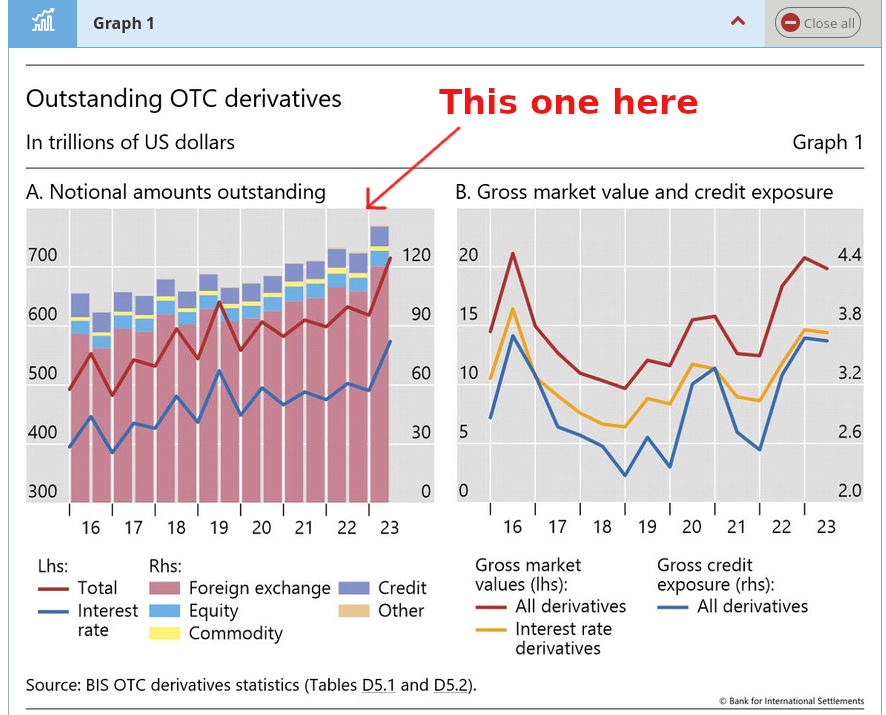
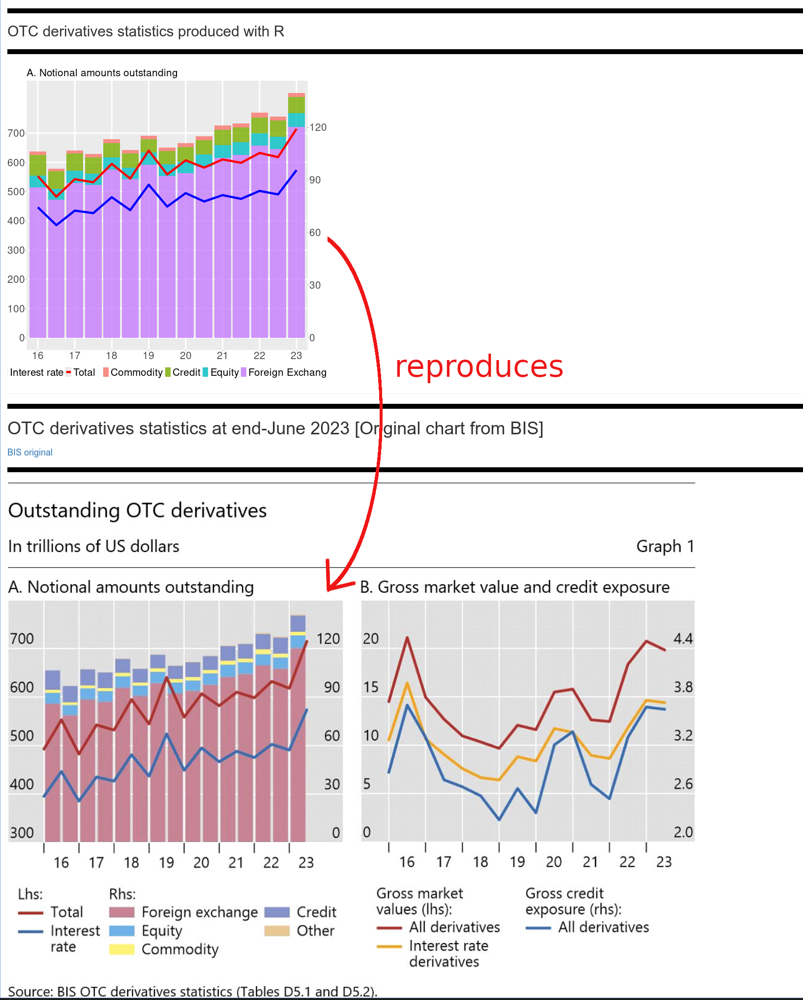

# bis-chart
## Small shiny app to reproduce a chart from a BIS publication

### The original chart

It can be found here : [graph 1, on the left](https://www.bis.org/publ/otc_hy2311.htm).

### Data source

According to the [chart description](https://stats.bis.org/statx/srs/tseries/OTC_DERIV/H.A.A.A.5J.A.5J.A.TO1.TO1.A.A.3.C?t=d5.1&c=&p=20231&i=1.4)
the data should be available [here](http://stats.bis.org:8089/statx/srs/tseries/OTC_DERIV/H:A:A:A:5J:A:5J:A:TO1:TO1:A:A:3:C?t=D5.1&c=&m=&p=20231&i=1.4&x=&f=CSV)
but the link does not work.

After some research, the CSV data could be found [here](https://data.bis.org/static/bulk/WS_OTC_DERIV2_csv_col.zip).

This CSV file is not completely consistent. For instance, to reproduce the same figures as the original chart,
sometimes the `Maturity` has to be set to :  
 - `"Total (all maturities)"`,  
and sometimes to  
 - `"Over 1 year and up to 5 years" + "Up to and including 1 year" + "Over 5 years"`.

Since there are only 3 maturities, using one or the other should produce the same figures, but it does not.

### Screenshots

### Screenshot of the original chart

### Screenshot of the app

